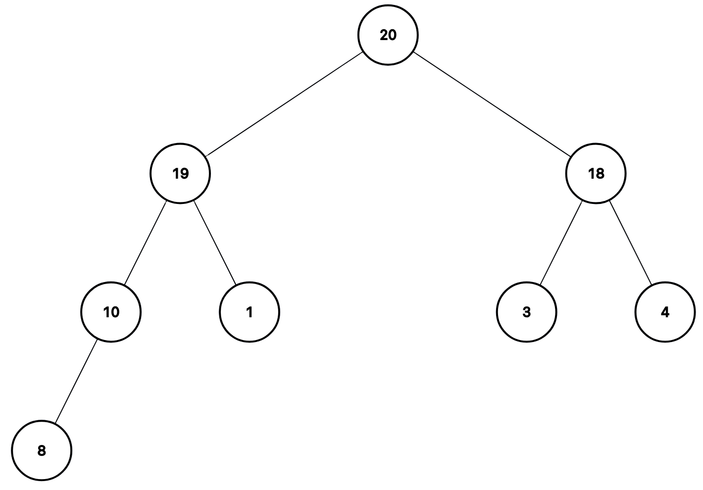

# 🧠 Heap

## 📝 Description

A **heap** is a specialized tree-based data structure that satisfies the _heap property_.
In the case of a **max-heap**, every parent node has a key **greater than or equal to** the keys of its children.
That is, for every node `n`, the key of `n` is **≥** the keys of its children.

Below is a visual example of a max-heap:

<div style="text-align: center;">
  
</div>

### 🧮 Array Representation

A binary heap is typically implemented using a **list** (array), traversed **top to bottom, left to right**.
For example, the heap shown above would be stored as:

```python
A = [20, 19, 18, 10, 1, 3, 4, 8]
```

To simplify indexing, we assume **1-based indexing**, so that:

- `A[1]` is the **root** of the heap
- `left(i) = 2i` is the index of the left child
- `right(i) = 2i + 1` is the index of the right child
- `parent(i) = ⌊i / 2⌋` is the index of the parent node

### 📐 Max-Heap Property

Using this indexing, the **max-heap property** can be formally written as:

For all `i` such that `1 ≤ i ≤ n`:

- If `left(i) ≤ n`, then $A[i] \ge A[\text{left}(i)]$
- If `right(i) ≤ n`, then $A[i] \ge A[\text{right}(i)]$

This ensures the largest element is always at the root
